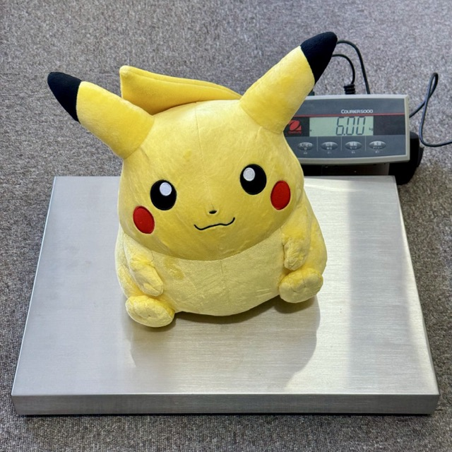

# POC: OHAUS Courier 5000 in the Browser

Read weight from an **OHAUS Courier 5000** scale directly from a web page,
using the Web Serial API. No drivers, no native helper, no backend.

**Live demo:** <https://white-rabbit-japan.github.io/web-serial-ohaus-courier/>

> Open in Chrome, Edge, or Opera. Firefox and Safari do not support Web Serial.



## How it works

The Courier 5000 enumerates as a **USB CDC-ACM** serial device. WebUSB cannot
talk to it — Chromium puts CDC interfaces on a protected-class blocklist that
refuses `claimInterface()`. The right API is **Web Serial**, which is designed
for exactly this case and ships in all Chromium-based browsers.

Link settings the scale expects:

| Setting     | Value |
|-------------|-------|
| Baud        | 9600  |
| Data bits   | 8     |
| Parity      | None  |
| Stop bits   | 1     |
| Flow ctrl   | None  |

Protocol is **OHAUS standard print** — *not* MT-SICS. Send `P\r\n` (or
`IP\r\n`) and the scale replies with one line:

```
       6.00    kg
```

(MT-SICS commands like `SI` / `S` come back as `ES` — syntax error.)

## Run the web app locally

```bash
npm install
npm run dev        # tsc build + python3 -m http.server on :8000
```

Then open <http://localhost:8000/>, click **Connect scale**, pick the
`usbmodem` device, and click **Read once** or enable **Stream**.

`http://localhost` is a secure context, so no HTTPS is needed for local
development. For deployment, push the `docs/` directory to any HTTPS host
(this repo serves it via GitHub Pages).

### Step-by-step scripts

```bash
npm run build      # compile src/ -> docs/
npm run watch      # incremental tsc for development
npm run serve      # python3 -m http.server --directory docs 8000
```

### Layout

```
src/main.ts        # TypeScript source
tsconfig.json
docs/index.html    # static page, deployable as-is
docs/main.js       # compiled output, committed (zero-build hosting)
```

## Appendix: CLI sanity-check (`weigh.py`)

A tiny Python script is included as a quick way to verify the scale and port
without a browser. Useful for first-time setup and debugging.

```bash
pip install pyserial
python3 weigh.py                # single reading
python3 weigh.py --stream       # continuous polling
python3 weigh.py --raw          # show raw scale response
python3 weigh.py --port /dev/cu.usbmodemXXXX
```

On macOS the scale shows up as `/dev/cu.usbmodem*`; on Linux it's typically
`/dev/ttyACM*`. The script auto-detects.
